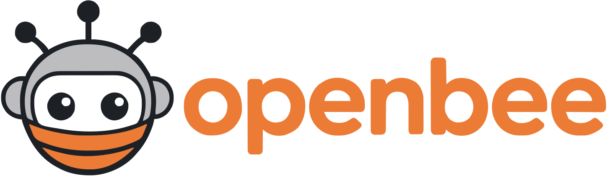
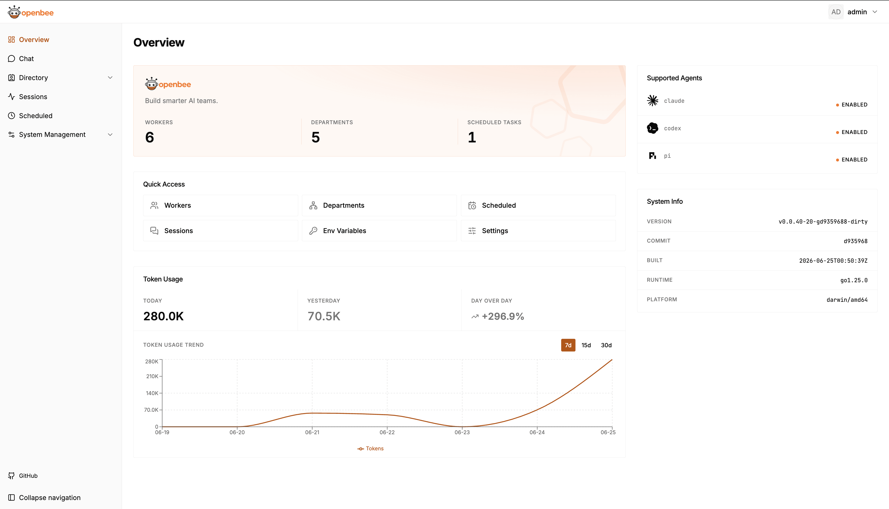
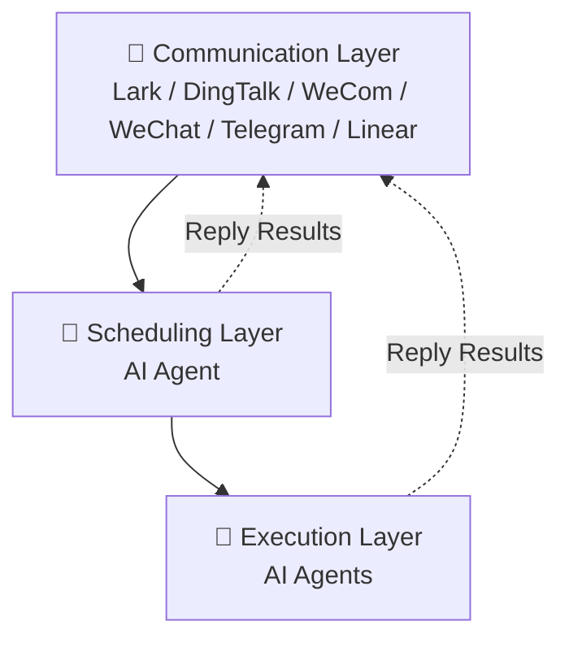

# OpenBee — Build smarter AI teams.

---

**OpenBee** is an around-the-clock digital worker solution, dedicated to making AI Agents your 7×24 always-on assistant.

To learn more about the project, visit [docs.theopenbee.com](https://docs.theopenbee.com).

[](https://www.npmjs.com/package/@theopenbee/cli)
[](https://www.npmjs.com/package/@theopenbee/cli)
[](LICENSE)
[](https://github.com/theopenbee/openbee/releases)
[](https://github.com/theopenbee/openbee)

<sub><a href="README.zh.md">中文</a> &nbsp;·&nbsp; <a href="https://docs.theopenbee.com">📖 Docs</a> &nbsp;·&nbsp; <a href="https://x.com/0xtyz">0xtyz</a></sub>

## 📸 Screenshots

---



## ✨ Features

<div align="center">

| | | |
|:---:|:---:|:---:|
| 🤖 **AI Workers** | 💬 **Multi-Platform Support** | ⏰ **Scheduled Tasks** |
| Each Worker is an AI Agent capable of multi-step task planning and independent execution | Native support for Lark, DingTalk, WeCom, WeChat, Telegram, and Linear — receive tasks and reply where the work starts | Cron-based scheduling for automatic, hands-free triggering |

</div>

## 🤖 Supported AI Engines

OpenBee supports multiple AI engines as the underlying execution backend:

| Engine | Description |
|:---:|:---|
| **Claude Code** | Anthropic's official agentic coding tool; default and recommended engine |
| **Codex** | OpenAI's Codex agent, supported via the plugin engine |
| **Pi** | Pi agent, supported via the plugin engine |

## 🚀 Quick Start

### Step 1: Install

<details open>
<summary>📦 npm (Recommended)</summary>

```bash
npm install -g @theopenbee/cli
```

The platform-specific binary is downloaded automatically. Supports Linux / macOS / Windows (amd64 & arm64).

</details>

<details>
<summary>🔧 One-click Script</summary>

```bash
curl -fsSL https://raw.githubusercontent.com/theopenbee/openbee/main/install.sh | bash
```

</details>

<details>
<summary>🍺 brew (macOS) / scoop (Windows)</summary>

**macOS (Homebrew):**
```bash
brew install theopenbee/tap/openbee
```

**Windows (Scoop):**
```bash
scoop bucket add theopenbee https://github.com/theopenbee/scoop-bucket
scoop install theopenbee/openbee
```

</details>

<details>
<summary>📥 Manual Binary Download</summary>

Visit [GitHub Releases](https://github.com/theopenbee/openbee/releases), download the archive for your platform, extract it, and place the `openbee` executable in your PATH.

</details>

### Step 2: Generate a config file

```bash
openbee config
```

The wizard will guide you through:
- Agent executable path
- Platform(s) to enable (Lark / DingTalk / WeCom / WeChat / Telegram / Linear) and their credentials
- Advanced options (can be skipped to use defaults)

The config file is written to `config.yaml` in the current directory by default. Use `-o` to specify a custom path:

```bash
openbee config -o /path/to/config.yaml
```

### Step 3: Start the service

```bash
openbee server -d
```

### Step 4: Start using

- Open the Web Console (default [http://localhost:8080](http://localhost:8080)) to manage Workers and view task status
- Send messages directly in any configured platform (Lark / DingTalk / WeCom / WeChat / Telegram / Linear) to interact with OpenBee

## ⚙️ How It Works



OpenBee consists of three core layers:

**1. Communication Layer**
Includes Lark, DingTalk, WeCom, WeChat, Telegram, and Linear. Users can send messages from chat platforms, or create and comment on Linear issues, then receive replies in the same conversation or issue thread.

**2. Scheduling Layer (AI Agent)**
Responsible for task scheduling — receives messages from the Communication layer, understands user intent, and dispatches tasks to the Execution layer for execution. It can also reply results directly to the Communication layer.

**3. Execution Layer**
Each Worker is an independent AI Agent, equipped with tool invocation (CLI) and multi-step task planning. Workers execute assigned tasks autonomously and reply results directly to the Communication layer — just like real workers.

## 🌟 Star History

<div align="center">

[](https://star-history.com/#theopenbee/openbee&Date)

</div>

## 🤝 Community

- 🐛 **Bug reports / Feature requests** → [GitHub Issues](https://github.com/theopenbee/openbee/issues)
- 🤝 **Contributing** → Please read the [Contributing Guide](CONTRIBUTING.md). You must agree to the [Contributor License Agreement (CLA)](CLA.md) before submitting.
