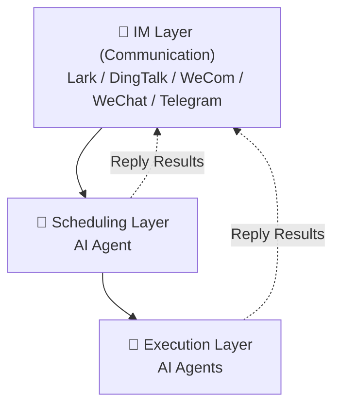

<div align="center">
  <h1>🐝 OpenBee</h1>
  <p><strong>Run Agents as your digital workers</strong></p>
</div>

<div align="center">

[](https://www.npmjs.com/package/@theopenbee/cli)
[](LICENSE)
[](https://github.com/theopenbee/openbee/releases)
[](https://github.com/theopenbee/openbee)

</div>

<p align="center">
  <a href="README.zh.md">中文</a> &nbsp;|&nbsp;
  <a href="https://docs.theopenbee.com">📖 Docs</a> &nbsp;|&nbsp;
  <a href="https://x.com/0XTYZ">Author @0XTYZ</a>
</p>

**OpenBee** is an around-the-clock digital worker solution, dedicated to making AI Agents your 7×24 always-on assistant.

## ✨ Features

<div align="center">

| | | | |
|:---:|:---:|:---:|:---:|
| 🤖 **AI Workers** | 💬 **Multi-IM Support** | 🧠 **Persistent Memory** | ⏰ **Scheduled Tasks** |
| Each Worker is an AI Agent capable of multi-step task planning and independent execution | Native support for Lark, DingTalk, WeCom, WeChat, and Telegram — receive and reply in the same conversation | Workers retain long-term memory across sessions, knowing context just like a real worker | Cron-based scheduling for automatic, hands-free triggering |

</div>

## 🚀 Quick Start

### Step 1: Install

<details open>
<summary>📦 npm (Recommended)</summary>

```bash
npm install -g @theopenbee/cli
```

The platform-specific binary is downloaded automatically. Supports Linux / macOS / Windows (amd64 & arm64).

</details>

<details>
<summary>🔧 One-click Script</summary>

```bash
curl -fsSL https://raw.githubusercontent.com/theopenbee/openbee/main/install.sh | bash
```

</details>

<details>
<summary>🍺 brew (macOS) / scoop (Windows)</summary>

**macOS (Homebrew):**
```bash
brew install theopenbee/tap/openbee
```

**Windows (Scoop):**
```bash
scoop bucket add theopenbee https://github.com/theopenbee/scoop-bucket
scoop install theopenbee/openbee
```

</details>

<details>
<summary>📥 Manual Binary Download</summary>

Visit [GitHub Releases](https://github.com/theopenbee/openbee/releases), download the archive for your platform, extract it, and place the `openbee` executable in your PATH.

</details>

### Step 2: Generate a config file

```bash
openbee config
```

The wizard will guide you through:
- Claude executable path
- IM platform(s) to enable (Lark / DingTalk / WeCom / WeChat / Telegram) and their credentials
- Advanced options (can be skipped to use defaults)

The config file is written to `config.yaml` in the current directory by default. Use `-o` to specify a custom path:

```bash
openbee config -o /path/to/config.yaml
```

### Step 3: Start the service

```bash
openbee server -d
```

### Step 4: Start using

- Open the Web Console (default [http://localhost:8080](http://localhost:8080)) to manage Workers and view task status
- Send messages directly in any configured IM platform (Lark / DingTalk / WeCom / WeChat / Telegram) to interact with OpenBee

## ⚙️ How It Works



OpenBee consists of three core layers:

**1. IM Layer (Communication Layer)**
Includes Lark, DingTalk, WeCom, WeChat, and Telegram. Users send messages through these platforms to interact with OpenBee, and receive replies in the same conversation.

**2. Scheduling Layer (AI Agent)**
Responsible for task scheduling — receives messages from the IM layer, understands user intent, and dispatches tasks to the Execution layer for execution. It can also reply results directly to the IM layer.

**3. Execution Layer**
Each Worker is an independent AI Agent, equipped with persistent memory, tool invocation (MCP), and multi-step task planning. Workers execute assigned tasks autonomously and reply results directly to the IM layer — just like real workers.

## 🌟 Star History

<div align="center">

[](https://star-history.com/#theopenbee/openbee&Date)

</div>

## 🤝 Community

- 🐛 **Bug reports / Feature requests** → [GitHub Issues](https://github.com/theopenbee/openbee/issues)
- 🤝 **Contributing** → Please read the [Contributing Guide](CONTRIBUTING.md). You must agree to the [Contributor License Agreement (CLA)](CLA.md) before submitting.
