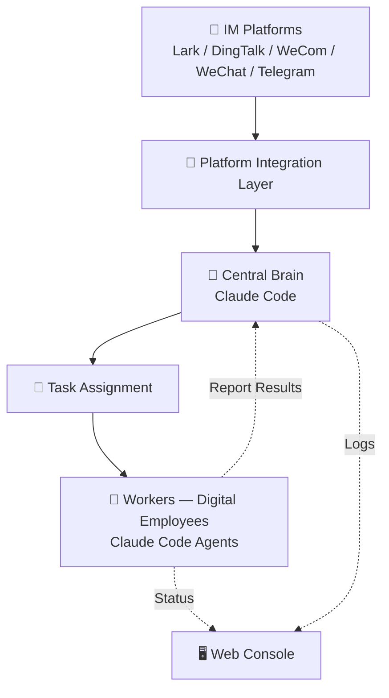

<div align="center">
  <h1>🐝 OpenBee</h1>
  <p><strong>Run Claude Code as your digital employee — command via Lark, DingTalk, WeCom, WeChat, or Telegram</strong></p>
</div>

<div align="center">

[](https://www.npmjs.com/package/@theopenbee/cli)
[](LICENSE)
[](https://github.com/theopenbee/openbee/releases)
[](https://github.com/theopenbee/openbee)

</div>

[中文](README.zh.md)

**OpenBee** is a digital employee solution that runs on your personal computer or server. You can communicate with it via Lark / DingTalk / WeCom / WeChat / Telegram to create workers, assign tasks, and much more — let your imagination run wild!

## ✨ Features

<div align="center">

| | | |
|:---:|:---:|:---:|
| 🤖 **AI Workers** | 💬 **Multi-IM Support** | 🧠 **Persistent Memory** |
| Each Worker is a Claude Code agent capable of multi-step task planning and independent execution | Native support for Lark, DingTalk, WeCom, WeChat, and Telegram — receive and reply in the same conversation | Workers retain long-term memory across sessions, knowing context just like a real employee |
| 🔧 **MCP Tool Invocation** | ⏰ **Scheduled Tasks** | 🖥️ **Web Console** |
| Extend capabilities via MCP protocol — read files, call APIs, query databases | Cron-based scheduling for automatic, hands-free triggering | Visual interface for Worker management, task history, and real-time logs |

</div>

## 🚀 Quick Start

### Step 1: Install

<details open>
<summary>📦 npm (Recommended)</summary>

```bash
npm install -g @theopenbee/cli
```

The platform-specific binary is downloaded automatically. Supports Linux / macOS / Windows (amd64 & arm64).

</details>

<details>
<summary>🔧 One-click Script</summary>

```bash
curl -fsSL https://raw.githubusercontent.com/theopenbee/openbee/main/install.sh | bash
```

</details>

<details>
<summary>🍺 brew (macOS) / scoop (Windows)</summary>

**macOS (Homebrew):**
```bash
brew install theopenbee/tap/openbee
```

**Windows (Scoop):**
```bash
scoop bucket add theopenbee https://github.com/theopenbee/scoop-bucket
scoop install theopenbee/openbee
```

</details>

<details>
<summary>📥 Manual Binary Download</summary>

Visit [GitHub Releases](https://github.com/theopenbee/openbee/releases), download the archive for your platform, extract it, and place the `openbee` executable in your PATH.

</details>

### Step 2: Generate a config file

```bash
openbee config
```

The wizard will guide you through:
- Server port / host
- Claude executable path
- MCP API Key (can be randomly generated)
- IM platform(s) to enable (Lark / DingTalk / WeCom / WeChat / Telegram) and their credentials
- Advanced options (can be skipped to use defaults)

The config file is written to `config.yaml` in the current directory by default. Use `-o` to specify a custom path:

```bash
openbee config -o /path/to/config.yaml
```

### Step 3: Start the service

```bash
openbee server -d
```

### Step 4: Start using

- Open the Web Console (default [http://localhost:8080](http://localhost:8080)) to manage Workers and view task status
- Send messages directly in any configured IM platform (Lark / DingTalk / WeCom / WeChat / Telegram) to interact with OpenBee

## ⚙️ How It Works



OpenBee consists of five core layers:

**1. Platform Integration Layer**
Connects to IM platforms such as Lark, DingTalk, WeCom, WeChat, and Telegram to receive user messages in real time and reply with results in the same conversation.

**2. Central Brain (Claude Code)**
The central brain receives all incoming messages, understands user intent, and decides how to break down and assign tasks. It coordinates the overall workflow and aggregates results from Workers.

**3. Task Assignment**
The central brain dispatches tasks to the appropriate Workers based on their capabilities and configuration. Scheduled tasks are also supported for automatic, time-based triggering.

**4. Workers (Digital Employees)**
Each Worker is an independent Claude Code agent, equipped with persistent memory, tool invocation (MCP), and multi-step task planning. Workers execute assigned tasks autonomously and report results back to the central brain — just like real employees.

**5. Web Console**
Provides a visual interface for Worker management, task execution history, and real-time logs, making monitoring and debugging straightforward.

## 🌟 Star History

<div align="center">

[](https://star-history.com/#theopenbee/openbee&Date)

</div>

## 🤝 Community

- 🐛 **Bug reports / Feature requests** → [GitHub Issues](https://github.com/theopenbee/openbee/issues)
- 🤝 **Contributing** → Please read the [Contributing Guide](CONTRIBUTING.md). You must agree to the [Contributor License Agreement (CLA)](CLA.md) before submitting.
