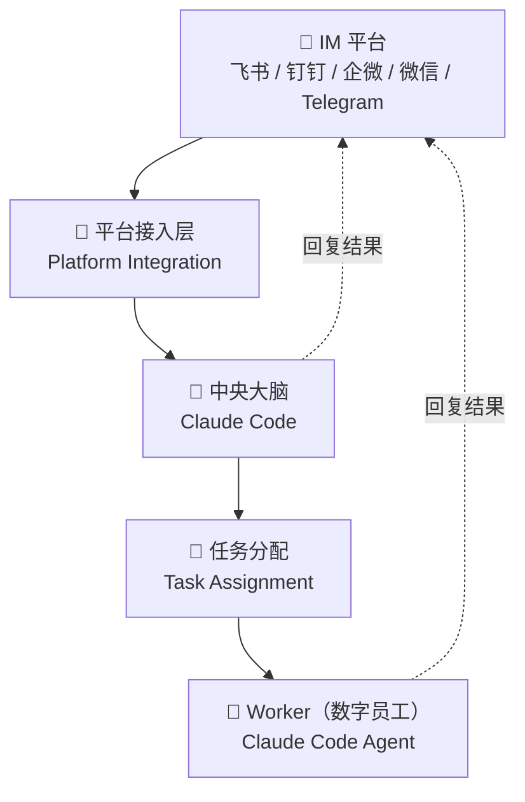

<div align="center">
  <h1>🐝 OpenBee</h1>
  <p><strong>让 Claude Code 成为你的数字员工 — 通过飞书/钉钉/企微/微信/Telegram 直接指挥</strong></p>
</div>

<div align="center">

[](https://www.npmjs.com/package/@theopenbee/cli)
[](LICENSE)
[](https://github.com/theopenbee/openbee/releases)
[](https://github.com/theopenbee/openbee)

</div>

[English](README.md)

**OpenBee** 是运行在私人电脑/服务器上的数字员工解决方案。你可以通过飞书/钉钉/企业微信/微信/Telegram 与它沟通，指挥它创建员工，给它发布任务等等操作，请充分发挥你的想象力！

## ✨ Features

<div align="center">

| | | |
|:---:|:---:|:---:|
| 🤖 **AI 数字员工** | 💬 **多平台 IM 接入** | 🧠 **持久记忆** |
| 每个 Worker 由 Claude Code 驱动，可独立规划和执行多步骤任务 | 原生支持飞书、钉钉、企业微信、微信、Telegram，消息收发零配置 | Worker 拥有跨会话的长期记忆，像真实员工一样了解上下文 |
| 🔧 **MCP 工具调用** | ⏰ **定时任务** | 🖥️ **Web 控制台** |
| 通过 MCP 协议扩展任意工具能力，读文件、调 API、操作数据库 | 支持 cron 表达式定时触发，自动化无需人工干预 | 可视化管理 Worker、查看任务历史和实时日志 |

</div>

## 🚀 快速开始

### 第一步：安装

<details open>
<summary>📦 npm（推荐）</summary>

```bash
npm install -g @theopenbee/cli
```

安装时会自动下载当前平台对应的二进制文件，支持 Linux / macOS / Windows（amd64 & arm64）。

</details>

<details>
<summary>🔧 一键安装脚本</summary>

```bash
curl -fsSL https://raw.githubusercontent.com/theopenbee/openbee/main/install.zh.sh | bash
```

</details>

<details>
<summary>🍺 brew（macOS）/ scoop（Windows）</summary>

**macOS（Homebrew）：**
```bash
brew install theopenbee/tap/openbee
```

**Windows（Scoop）：**
```bash
scoop bucket add theopenbee https://github.com/theopenbee/scoop-bucket
scoop install theopenbee/openbee
```

</details>

<details>
<summary>📥 手动下载二进制</summary>

前往 [GitHub Releases](https://github.com/theopenbee/openbee/releases) 页面，下载对应平台的压缩包，解压后将 `openbee` 可执行文件放入 PATH 即可。

</details>

### 第二步：交互式生成配置文件

```bash
openbee config
```

向导将引导你完成以下配置：
- 服务端口 / 主机
- Claude 可执行文件路径
- MCP API Key（可随机生成）
- 启用的 IM 平台（飞书 / 钉钉 / 企微 / 微信 / Telegram）及对应凭证
- 高级选项（可跳过，使用默认值）

配置文件默认写入当前目录的 `config.yaml`，如需指定路径，使用 `-o` 参数：

```bash
openbee config -o /path/to/config.yaml
```

### 第三步：启动服务

```bash
openbee server -d
```

### 第四步：开始使用

- 打开 Web 控制台（默认 [http://localhost:8080](http://localhost:8080)）管理 Worker 和查看任务状态
- 在已配置的 IM 平台（飞书 / 钉钉 / 企微 / 微信 / Telegram）中直接发送消息与 OpenBee 交互

## ⚙️ 工作原理



OpenBee 由四个核心层构成：

**1. 平台接入层**
连接飞书、钉钉、企微、微信、Telegram 等 IM 平台，实时接收用户消息，并将结果回复到对话中。

**2. 中央大脑（Claude Code）**
中央大脑接收所有消息，理解用户意图，决定如何处理。除了任务分配外，它还负责员工管理、会话管理等协调工作，并可将结果直接回复到 IM 平台。

**3. 任务分配**
中央大脑根据 Worker 的能力和配置，将任务分派给合适的 Worker 执行；同时支持定时任务，可按计划自动触发。

**4. Worker（数字员工）**
每个 Worker 是一个独立的 Claude Code 智能体，具备持久记忆、工具调用（MCP）和多步任务规划能力。Worker 自主执行分配的任务，并将结果直接回复到 IM 平台——像真实员工一样独立完成工作。

## 🌟 Star History

<div align="center">

[](https://star-history.com/#theopenbee/openbee&Date)

</div>

## 🤝 Community

- 🐛 **问题反馈 / 功能建议** → [GitHub Issues](https://github.com/theopenbee/openbee/issues)
- 🤝 **贡献代码** → 请阅读 [贡献指南](CONTRIBUTING.md)，提交前需同意 [贡献者许可协议（CLA）](CLA.zh.md)
