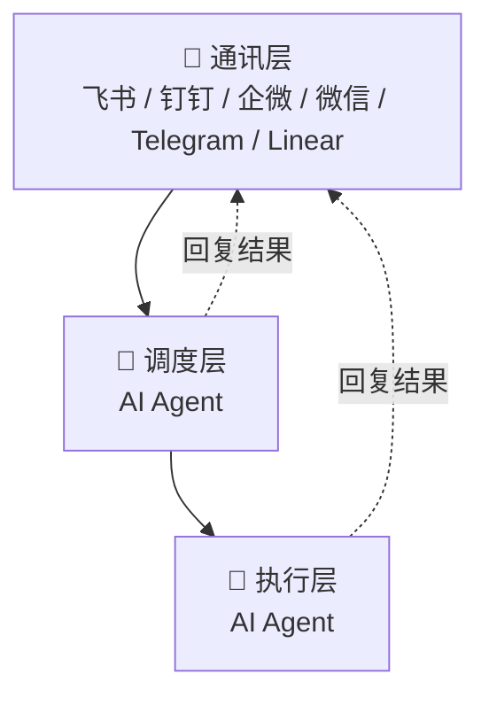

<div align="center">
  <h1>🐝 OpenBee</h1>
  <p><strong>让 AI agent 成为你的数字员工</strong></p>
</div>

<div align="center">

[](https://www.npmjs.com/package/@theopenbee/cli)
[](https://www.npmjs.com/package/@theopenbee/cli)
[](LICENSE)
[](https://github.com/theopenbee/openbee/releases)
[](https://github.com/theopenbee/openbee)

</div>

<p align="center">
  <a href="README.md">English</a> &nbsp;|&nbsp;
  <a href="https://docs.theopenbee.com">📖 文档</a> &nbsp;|&nbsp;
  <a href="https://x.com/0xtyz">0xtyz</a>
</p>

**OpenBee** 是一款全天候的数字员工解决方案，致力于让 AI Agent 成为您 7×24 小时在线的得力助手。

## ✨ Features

<div align="center">

| | | |
|:---:|:---:|:---:|
| 🤖 **AI 数字员工** | 💬 **多平台接入** | ⏰ **定时任务** |
| 每个 Worker 是一个 AI Agent，可独立规划和执行多步骤任务 | 原生支持飞书、钉钉、企业微信、微信、Telegram 和 Linear，任务从哪里来就回复到哪里 | 支持 cron 表达式定时触发，自动化无需人工干预 |

</div>

## 🤖 支持的 AI 引擎

OpenBee 支持多种 AI 引擎作为底层执行后端：

| 引擎 | 说明 |
|:---:|:---|
| **Claude Code** | Anthropic 官方 Agentic 编码工具，默认推荐引擎 |
| **Codex** | OpenAI Codex Agent，通过插件引擎支持 |
| **Pi** | Pi Agent，通过插件引擎支持 |
| **Kimi** | Moonshot AI 的 Kimi Agent，通过插件引擎支持 |

## 🚀 快速开始

### 第一步：安装

<details open>
<summary>📦 npm（推荐）</summary>

```bash
npm install -g @theopenbee/cli
```

安装时会自动下载当前平台对应的二进制文件，支持 Linux / macOS / Windows（amd64 & arm64）。

</details>

<details>
<summary>🔧 一键安装脚本</summary>

```bash
curl -fsSL https://dl.theopenbee.cn/install.sh | bash
```

</details>

<details>
<summary>🍺 brew（macOS）/ scoop（Windows）</summary>

**macOS（Homebrew）：**
```bash
brew install theopenbee/tap/openbee
```

**Windows（Scoop）：**
```bash
scoop bucket add theopenbee https://github.com/theopenbee/scoop-bucket
scoop install theopenbee/openbee
```

</details>

<details>
<summary>📥 手动下载二进制</summary>

前往 [GitHub Releases](https://github.com/theopenbee/openbee/releases) 页面，下载对应平台的压缩包，解压后将 `openbee` 可执行文件放入 PATH 即可。

</details>

### 第二步：交互式生成配置文件

```bash
openbee config
```

向导将引导你完成以下配置：
- agent 可执行文件路径
- 启用的平台（飞书 / 钉钉 / 企微 / 微信 / Telegram / Linear）及对应凭证
- 高级选项（可跳过，使用默认值）

配置文件默认写入当前目录的 `config.yaml`，如需指定路径，使用 `-o` 参数：

```bash
openbee config -o /path/to/config.yaml
```

### 第三步：启动服务

```bash
openbee server -d
```

### 第四步：开始使用

- 打开 Web 控制台（默认 [http://localhost:8080](http://localhost:8080)）管理 Worker 和查看任务状态
- 在已配置的平台（飞书 / 钉钉 / 企微 / 微信 / Telegram / Linear）中直接发送消息，或创建、评论 Linear issue 与 OpenBee 交互

## ⚙️ 工作原理



OpenBee 由三个核心层构成：

**1. 通讯层**
包含飞书、钉钉、企业微信、微信、Telegram 和 Linear。用户可以通过聊天平台发送消息，也可以创建或评论 Linear issue，并在同一对话或 issue 线程中接收回复。

**2. 调度层（AI Agent）**
负责任务调度——接收来自通讯层的消息，理解用户意图，并将任务分派给执行层执行。支持定时任务，可按计划自动触发。调度层也可将结果直接回复到通讯层。

**3. 执行层**
每个 Worker 是一个独立的 AI Agent 智能体，具备工具调用（CLI）和多步任务规划能力。Worker 自主执行分配的任务，并将结果直接回复到通讯层——像真实员工一样独立完成工作。

## 🌟 Star History

<div align="center">

[](https://star-history.com/#theopenbee/openbee&Date)

</div>

## 🤝 Community

- 🐛 **问题反馈 / 功能建议** → [GitHub Issues](https://github.com/theopenbee/openbee/issues)
- 🤝 **贡献代码** → 请阅读 [贡献指南](CONTRIBUTING.md)，提交前需同意 [贡献者许可协议（CLA）](CLA.md)
