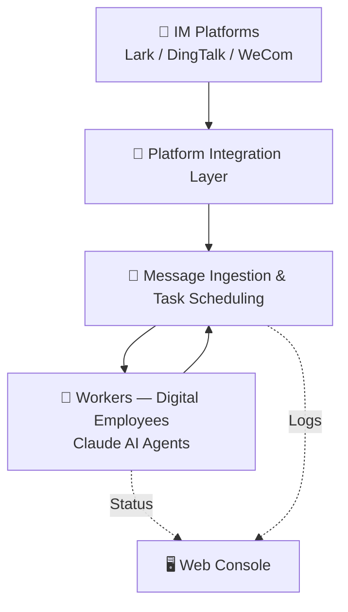
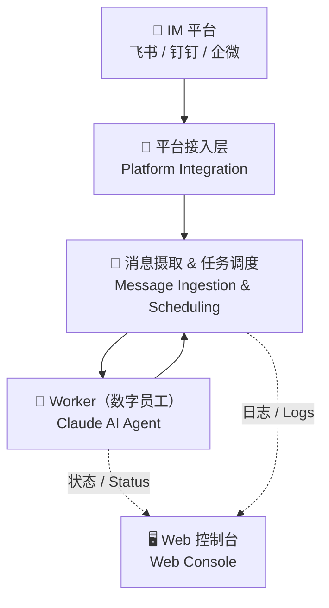

# README Beautification Implementation Plan

> **For agentic workers:** REQUIRED SUB-SKILL: Use superpowers:subagent-driven-development (recommended) or superpowers:executing-plans to implement this plan task-by-task. Steps use checkbox (`- [ ]`) syntax for tracking.

**Goal:** Beautify `README.md` (English) and `README.zh.md` (Chinese) with a Hero Banner, badge row, Features grid, restructured Quick Start, Mermaid architecture diagram, and polished Community section.

**Architecture:** Two Markdown files are updated in parallel, maintaining strict content parity with language-specific differences (install script URLs, CLA filenames, feature label language). No code changes — this plan modifies documentation only.

**Tech Stack:** GitHub Flavored Markdown, shields.io badges, HTML `<div>` centering, Mermaid diagrams, `<details>` collapse blocks

**Spec:** `docs/superpowers/specs/2026-03-18-readme-beautification-design.md`

---

## File Map

| File | Action | Changes |
|------|--------|---------|
| `README.md` | Modify | All sections updated per spec |
| `README.zh.md` | Modify | All sections updated per spec (Chinese language + different install.zh.sh and CLA.zh.md) |

---

## Task 1: Pre-flight — Check npm Package Status

**Files:**
- Read: `README.md`, `README.zh.md` (current state baseline)

Determine which npm badge form to use before writing any content.

- [ ] **Step 1.1: Check if `@theopenbee/cli` is published on npm**

```bash
npm view @theopenbee/cli version 2>/dev/null && echo "PUBLISHED" || echo "NOT PUBLISHED"
```

Expected output: either a version number + `PUBLISHED`, or `NOT PUBLISHED`.

- [ ] **Step 1.2: Record badge form to use**

If `PUBLISHED`: use dynamic badge (form A):
```
[](https://www.npmjs.com/package/@theopenbee/cli)
```

If `NOT PUBLISHED`: use static badge (form B):
```
[](https://www.npmjs.com/package/@theopenbee/cli)
```

Note which form applies — use it consistently in Task 2.

---

## Task 2: Hero Banner + Badge Row

**Files:**
- Modify: `README.md` (lines 1–5)
- Modify: `README.zh.md` (lines 1–5)

Replace the existing `# 🐝 OpenBee — ...` heading and language toggle with the centered banner + badge row + language toggle.

- [ ] **Step 2.1: Update the top of `README.md`**

Replace the current first 4 lines:
```markdown
# 🐝 OpenBee — Digital Employee (OPC) Solution

[中文](README.zh.md)

**OpenBee** is a digital employee solution...
```

With:
```markdown
<div align="center">
  <h1>🐝 OpenBee</h1>
  <p><strong>Run Claude AI as your digital employee — command via Lark, DingTalk, or WeCom</strong></p>
</div>

<div align="center">

[](https://www.npmjs.com/package/@theopenbee/cli)
[](LICENSE)
[](https://github.com/theopenbee/openbee/releases)
[](https://github.com/theopenbee/openbee)

</div>

[中文](README.zh.md)

**OpenBee** is a digital employee solution...
```

> Note: If npm is NOT PUBLISHED (from Task 1), replace the npm badge line with the static form B.

- [ ] **Step 2.2: Verify README.md banner structure**

```bash
head -20 README.md
```

Expected: `<div align="center">` on line 1, `<h1>🐝 OpenBee</h1>` on line 2, four badge lines, `[中文]` link.

- [ ] **Step 2.3: Update the top of `README.zh.md`**

Replace the current first 4 lines with the Chinese version:
```markdown
<div align="center">
  <h1>🐝 OpenBee</h1>
  <p><strong>让 Claude AI 成为你的数字员工 — 通过飞书/钉钉/企微直接指挥</strong></p>
</div>

<div align="center">

[](https://www.npmjs.com/package/@theopenbee/cli)
[](LICENSE)
[](https://github.com/theopenbee/openbee/releases)
[](https://github.com/theopenbee/openbee)

</div>

[English](README.md)

**OpenBee** 是运行在私人电脑/服务器上的数字员工解决方案...
```

> Note: Same npm badge decision as README.md. Badges are identical in both files.

- [ ] **Step 2.4: Verify README.zh.md banner structure**

```bash
head -20 README.zh.md
```

Expected: Same structure as README.md with Chinese tagline and `[English]` link.

- [ ] **Step 2.5: Commit**

```bash
git add README.md README.zh.md
git commit -m "docs: add hero banner and badge row to README (EN+ZH)"
```

---

## Task 3: ✨ Features Section

**Files:**
- Modify: `README.md` — insert Features section after the intro paragraph
- Modify: `README.zh.md` — insert Features section after the intro paragraph

- [ ] **Step 3.1: Add Features section to `README.md`**

After the one-line intro paragraph (`**OpenBee** is a digital employee solution...`), insert:

```markdown
## ✨ Features

<div align="center">

| | | |
|:---:|:---:|:---:|
| 🤖 **AI Workers** | 💬 **Multi-IM Support** | 🧠 **Persistent Memory** |
| Each Worker is a Claude AI agent capable of multi-step task planning and independent execution | Native support for Lark, DingTalk, and WeCom — receive and reply in the same conversation | Workers retain long-term memory across sessions, knowing context just like a real employee |
| 🔧 **MCP Tool Invocation** | ⏰ **Scheduled Tasks** | 🖥️ **Web Console** |
| Extend capabilities via MCP protocol — read files, call APIs, query databases | Cron-based scheduling for automatic, hands-free triggering | Visual interface for Worker management, task history, and real-time logs |

</div>
```

- [ ] **Step 3.2: Verify Features section in README.md**

```bash
grep -n "✨ Features" README.md
```

Expected: one match with the section heading line number.

```bash
grep -c "🤖\|💬\|🧠\|🔧\|⏰\|🖥️" README.md
```

Expected: 6 or more matches (one per feature emoji).

- [ ] **Step 3.3: Add Features section to `README.zh.md`**

After the Chinese intro paragraph, insert:

```markdown
## ✨ Features

<div align="center">

| | | |
|:---:|:---:|:---:|
| 🤖 **AI 数字员工** | 💬 **多平台 IM 接入** | 🧠 **持久记忆** |
| 每个 Worker 由 Claude AI 驱动，可独立规划和执行多步骤任务 | 原生支持飞书、钉钉、企业微信，消息收发零配置 | Worker 拥有跨会话的长期记忆，像真实员工一样了解上下文 |
| 🔧 **MCP 工具调用** | ⏰ **定时任务** | 🖥️ **Web 控制台** |
| 通过 MCP 协议扩展任意工具能力，读文件、调 API、操作数据库 | 支持 cron 表达式定时触发，自动化无需人工干预 | 可视化管理 Worker、查看任务历史和实时日志 |

</div>
```

- [ ] **Step 3.4: Verify Features section in README.zh.md**

```bash
grep -n "✨ Features" README.zh.md
grep -c "🤖\|💬\|🧠\|🔧\|⏰\|🖥️" README.zh.md
```

Expected: heading found, 6+ emoji matches.

- [ ] **Step 3.5: Commit**

```bash
git add README.md README.zh.md
git commit -m "docs: add Features grid section to README (EN+ZH)"
```

---

## Task 4: 🚀 Quick Start Restructure

**Files:**
- Modify: `README.md` — merge `## Installation` into new `## 🚀 Quick Start`
- Modify: `README.zh.md` — same restructure with Chinese content and `install.zh.sh`

The old `## Installation` heading is **deleted**. The new `## 🚀 Quick Start` replaces both old sections as a single 4-step flow.

- [ ] **Step 4.1: Replace Installation + Quick Start sections in `README.md`**

Delete the existing `## Installation` section and `## Quick Start` section entirely. Replace with:

```markdown
## 🚀 Quick Start

### Step 1: Install

```bash
npm install -g @theopenbee/cli
```

The platform-specific binary is downloaded automatically. Supports Linux / macOS / Windows (amd64 & arm64).

<details>
<summary>Other install methods</summary>

**One-click script:**
```bash
curl -fsSL https://raw.githubusercontent.com/theopenbee/openbee/main/install.sh | bash
```

**Manual binary download:**
Visit [GitHub Releases](https://github.com/theopenbee/openbee/releases), download the archive for your platform, extract it, and place the `openbee` executable in your PATH.

</details>

### Step 2: Generate a config file

```bash
openbee config
```

The wizard will guide you through:
- Server port / host
- Claude executable path
- MCP API Key (can be randomly generated)
- IM platform(s) to enable (Lark / DingTalk / WeCom) and their credentials
- Advanced options (can be skipped to use defaults)

The config file is written to `config.yaml` in the current directory by default. Use `-o` to specify a custom path:

```bash
openbee config -o /path/to/config.yaml
```

### Step 3: Start the service

```bash
openbee start
```

### Step 4: Start using

- Open the Web Console (default [http://localhost:8080](http://localhost:8080)) to manage Workers and view task status
- Send messages directly in any configured IM platform (Lark / DingTalk / WeCom) to interact with OpenBee
```

- [ ] **Step 4.2: Verify restructure in README.md**

```bash
grep -n "## Installation\|## Quick Start\|## 🚀 Quick Start" README.md
```

Expected: only `## 🚀 Quick Start` found. `## Installation` must not appear.

```bash
grep -n "install.sh\|install.zh.sh" README.md
```

Expected: only `install.sh` appears (not `install.zh.sh`).

- [ ] **Step 4.3: Replace Installation + Quick Start sections in `README.zh.md`**

Delete existing `## 安装` and `## 快速开始` sections. Replace with:

```markdown
## 🚀 快速开始

### 第一步：安装

```bash
npm install -g @theopenbee/cli
```

安装时会自动下载当前平台对应的二进制文件，支持 Linux / macOS / Windows（amd64 & arm64）。

<details>
<summary>其他安装方式</summary>

**脚本一键安装：**
```bash
curl -fsSL https://raw.githubusercontent.com/theopenbee/openbee/main/install.zh.sh | bash
```

**手动下载二进制：**
前往 [GitHub Releases](https://github.com/theopenbee/openbee/releases) 页面，下载对应平台的压缩包，解压后将 `openbee` 可执行文件放入 PATH 即可。

</details>

### 第二步：交互式生成配置文件

```bash
openbee config
```

向导将引导你完成以下配置：
- 服务端口 / 主机
- Claude 可执行文件路径
- MCP API Key（可随机生成）
- 启用的 IM 平台（飞书 / 钉钉 / 企微）及对应凭证
- 高级选项（可跳过，使用默认值）

配置文件默认写入当前目录的 `config.yaml`，如需指定路径，使用 `-o` 参数：

```bash
openbee config -o /path/to/config.yaml
```

### 第三步：启动服务

```bash
openbee start
```

### 第四步：开始使用

- 打开 Web 控制台（默认 [http://localhost:8080](http://localhost:8080)）管理 Worker 和查看任务状态
- 在已配置的 IM 平台（飞书 / 钉钉 / 企微）中直接发送消息与 OpenBee 交互
```

- [ ] **Step 4.4: Verify restructure in README.zh.md**

```bash
grep -n "## 安装\|## 快速开始\|## 🚀 快速开始" README.zh.md
```

Expected: only `## 🚀 快速开始` found.

```bash
grep -n "install.zh.sh\|install.sh" README.zh.md
```

Expected: only `install.zh.sh` appears (not bare `install.sh`).

- [ ] **Step 4.5: Commit**

```bash
git add README.md README.zh.md
git commit -m "docs: restructure Quick Start — merge Installation section (EN+ZH)"
```

---

## Task 5: ⚙️ How It Works — Mermaid Architecture Diagram

**Files:**
- Modify: `README.md` — add Mermaid diagram above existing 4-layer text
- Modify: `README.zh.md` — same diagram (bilingual node labels) above existing text

The existing 4-layer text descriptions are **kept** as fallback content below the diagram.

- [ ] **Step 5.1: Add Mermaid diagram to `README.md`**

At the top of the `## How It Works` section, before the existing numbered layer descriptions, insert:

````markdown

````

Update the section heading to `## ⚙️ How It Works`.

- [ ] **Step 5.2: Verify Mermaid block in README.md**

```bash
grep -n "mermaid\|⚙️ How It Works" README.md
```

Expected: `## ⚙️ How It Works` heading and ` ```mermaid ` fence found.

```bash
grep -c "graph TD\|Platform Integration\|Task Scheduling" README.md
```

Expected: 3 matches.

- [ ] **Step 5.3: Add Mermaid diagram to `README.zh.md`**

At the top of `## 工作原理`, before existing layer text, insert:

````markdown

````

Update the section heading to `## ⚙️ 工作原理`.

- [ ] **Step 5.4: Verify Mermaid block in README.zh.md**

```bash
grep -n "mermaid\|⚙️ 工作原理" README.zh.md
```

Expected: updated heading and mermaid fence found.

```bash
grep -c "graph TD\|平台接入层\|任务调度" README.zh.md
```

Expected: 3 matches.

- [ ] **Step 5.5: Commit**

```bash
git add README.md README.zh.md
git commit -m "docs: add Mermaid architecture diagram to How It Works (EN+ZH)"
```

---

## Task 6: 🌟 Star History + 🤝 Community Polish

**Files:**
- Modify: `README.md` — center Star History, add emoji bullets to Community
- Modify: `README.zh.md` — same, with Chinese CLA link (`CLA.zh.md`)

- [ ] **Step 6.1: Update Star History section in `README.md`**

Replace:
```markdown
## Star History

[](https://star-history.com/#theopenbee/openbee&Date)
```

With:
```markdown
## 🌟 Star History

<div align="center">

[](https://star-history.com/#theopenbee/openbee&Date)

</div>
```

- [ ] **Step 6.2: Update Community section in `README.md`**

Replace:
```markdown
## Community

- **Bug reports / Feature requests**: [GitHub Issues](https://github.com/theopenbee/openbee/issues)
- **Contributing**: Please read the [Contributing Guide](CONTRIBUTING.md). You must agree to the [Contributor License Agreement (CLA)](CLA.md) before submitting.
```

With:
```markdown
## 🤝 Community

- 🐛 **Bug reports / Feature requests** → [GitHub Issues](https://github.com/theopenbee/openbee/issues)
- 🤝 **Contributing** → Please read the [Contributing Guide](CONTRIBUTING.md). You must agree to the [Contributor License Agreement (CLA)](CLA.md) before submitting.
```

- [ ] **Step 6.3: Verify Star History and Community in README.md**

```bash
grep -n "🌟 Star History\|🤝 Community\|div align" README.md
```

Expected: both emoji headings found, `div align="center"` wrapping Star History.

- [ ] **Step 6.4: Update Star History section in `README.zh.md`**

Same centering treatment:
```markdown
## 🌟 Star History

<div align="center">

[](https://star-history.com/#theopenbee/openbee&Date)

</div>
```

- [ ] **Step 6.5: Update Community section in `README.zh.md`**

Replace existing Community section with (note: `CLA.zh.md` — not `CLA.md`):
```markdown
## 🤝 Community

- 🐛 **问题反馈 / 功能建议** → [GitHub Issues](https://github.com/theopenbee/openbee/issues)
- 🤝 **贡献代码** → 请阅读 [贡献指南](CONTRIBUTING.md)，提交前需同意 [贡献者许可协议（CLA）](CLA.zh.md)
```

- [ ] **Step 6.6: Verify Star History and Community in README.zh.md**

```bash
grep -n "🌟 Star History\|🤝 Community\|CLA.zh.md\|CLA.md" README.zh.md
```

Expected: `🌟 Star History`, `🤝 Community` headings present; `CLA.zh.md` found; `CLA.md` (without `.zh`) must NOT appear in the community line.

- [ ] **Step 6.7: Commit**

```bash
git add README.md README.zh.md
git commit -m "docs: polish Star History centering and Community emoji bullets (EN+ZH)"
```

---

## Task 7: Final Verification

**Files:**
- Read: `README.md`, `README.zh.md`

- [ ] **Step 7.1: Verify complete structure of README.md**

```bash
grep -n "^## \|^<div\|^\[中文\]" README.md
```

Expected output (in order):
```
<div align="center">       ← banner
<div align="center">       ← badge row
[中文](README.zh.md)
## ✨ Features
## 🚀 Quick Start
## ⚙️ How It Works
## 🌟 Star History
## 🤝 Community
```

`## Installation` must not appear.

- [ ] **Step 7.2: Verify complete structure of README.zh.md**

```bash
grep -n "^## \|^<div\|^\[English\]" README.zh.md
```

Expected same section order with Chinese headings. `## 安装` must not appear.

- [ ] **Step 7.3: Verify no cross-language contamination**

```bash
# English README must not reference install.zh.sh
grep "install.zh.sh" README.md && echo "FAIL" || echo "OK"

# Chinese README must not use bare install.sh
grep '"install.sh"' README.zh.md && echo "FAIL" || echo "OK"

# Chinese README must use CLA.zh.md in Community section
grep "CLA.zh.md" README.zh.md && echo "OK" || echo "FAIL"

# English README must use CLA.md (not CLA.zh.md) in Community section
grep "CLA.zh.md" README.md && echo "FAIL — wrong CLA link" || echo "OK"
```

All four checks must print `OK`.

- [ ] **Step 7.4: Confirm no duplicate install instructions**

```bash
grep -c "npm install -g @theopenbee/cli" README.md
grep -c "npm install -g @theopenbee/cli" README.zh.md
```

Expected: exactly `1` in each file (only in Quick Start, old Installation section gone).

- [ ] **Step 7.5: Verify badge links are not empty**

```bash
grep 'img.shields.io' README.md | grep -v 'https://' && echo "FOUND EMPTY LINK" || echo "All badges have links"
```

Expected: `All badges have links`.

- [ ] **Step 7.6: Final commit if any cleanup was needed**

```bash
git status
# If clean, nothing to do.
# If any fixes were made during verification, commit them:
git add README.md README.zh.md
git commit -m "docs: final README beautification cleanup"
```
