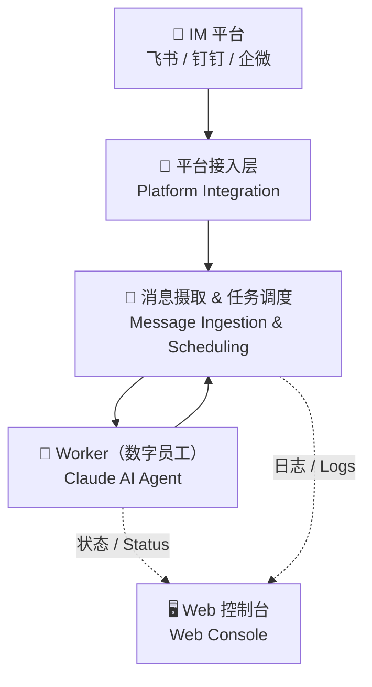

# README Beautification Design

**Date:** 2026-03-18
**Scope:** `README.md` (English) + `README.zh.md` (Chinese)
**Approach:** Option B — GitHub-Standard Rich README

---

## Background

The current READMEs are functionally complete but visually plain. They cover installation (3 methods), quick start (3 steps), how it works (4 layers), Star History, and Community links. Missing elements identified:

- No project Logo / Hero Banner
- No badges (version, license, platform, stars)
- No visual feature highlights
- Architecture described in plain text only
- No table of contents structure

## Goals

Comprehensive brand enhancement targeting:
1. Professional visual identity through SVG-style banner + badge row
2. Scannable feature highlights via emoji grid table
3. Visual architecture through Mermaid diagram
4. Cleaner Quick Start flow with collapsible secondary content
5. Full Chinese ↔ English content parity

**Non-goals:** Screenshots/GIFs (deferred), FAQ/Roadmap/Contributors section (Option C scope).

---

## Design

### 1. Hero Banner

Centered HTML layout using GitHub Markdown's `<div align="center">`:

```markdown
<div align="center">
  <h1>🐝 OpenBee</h1>
  <p><strong>Run Claude AI as your digital employee — command via Lark, DingTalk, or WeCom</strong></p>
</div>
```

Chinese tagline: `让 Claude AI 成为你的数字员工 — 通过飞书/钉钉/企微直接指挥`

### 2. Badge Row

Four badges using shields.io, themed with honey yellow `#F7C948` to match the brand:

```markdown
[](https://www.npmjs.com/package/@theopenbee/cli)
[](LICENSE)
[](https://github.com/theopenbee/openbee/releases)
[](https://github.com/theopenbee/openbee)
```

**npm badge note:** `@theopenbee/cli` is currently at version `0.0.0` (placeholder). If the package has not yet been published to the npm registry, the dynamic npm badge will render as a red "not found" error. In that case, replace with a static badge until the package is live:

```markdown
[](https://www.npmjs.com/package/@theopenbee/cli)
```

The implementer must check whether `@theopenbee/cli` is published before choosing which form to use.

### 3. Features Section (✨ Features)

3-column HTML table with emoji icons + one-line description per feature. 6 features total (2 rows × 3 columns). The table below shows documentation shorthand — each README uses its own language only (no bilingual slash notation in the actual files):

| Column 1 | Column 2 | Column 3 |
|---|---|---|
| 🤖 AI Workers (EN) / AI 数字员工 (ZH) | 💬 Multi-IM Support (EN) / 多平台 IM 接入 (ZH) | 🧠 Persistent Memory (EN) / 持久记忆 (ZH) |
| 🔧 MCP Tool Invocation (EN) / MCP 工具调用 (ZH) | ⏰ Scheduled Tasks (EN) / 定时任务 (ZH) | 🖥️ Web Console (EN) / Web 控制台 (ZH) |

`README.md` uses the English label only. `README.zh.md` uses the Chinese label only. Each cell also includes a one-sentence description in its respective language.

Implementation using `<div align="center">` wrapping a Markdown table for center alignment on GitHub.

### 4. Quick Start Restructure (🚀 Quick Start)

The existing `## Installation` heading is **removed entirely**. Its content is merged into a new unified `## 🚀 Quick Start` section as a 4-step flow:

1. **Install** — npm install (primary), with `<details>` collapsing alternative methods (script + manual binary)
2. **Generate config** — `openbee config`
3. **Start service** — `openbee start`
4. **Use** — Web Console URL + IM platform instruction

The `<details>` block for alternative methods:

```markdown
<details>
<summary>Other install methods / 其他安装方式</summary>

**Script (English README):**
```bash
curl -fsSL https://raw.githubusercontent.com/theopenbee/openbee/main/install.sh | bash
```

**Script (Chinese README — uses install.zh.sh):**
```bash
curl -fsSL https://raw.githubusercontent.com/theopenbee/openbee/main/install.zh.sh | bash
```

**Manual binary:** [GitHub Releases](https://github.com/theopenbee/openbee/releases)

</details>
```

**Important:** The script URL in the `<details>` block differs by language version:
- `README.md` → `install.sh`
- `README.zh.md` → `install.zh.sh`

### 5. Architecture Diagram (⚙️ How It Works)

Replace plain-text 4-layer description with a Mermaid flowchart followed by the existing text descriptions as a Mermaid-failure fallback and supplementary detail:



**Edge semantics:**
- Solid arrows (`-->`) represent the request/task flow: IM message → Integration → Scheduling → Worker → back to Scheduling (for result delivery)
- Dotted arrows (`-.->`) represent monitoring data flowing into the Web Console: Workers and Scheduler push status/logs to the Web Console. The Web Console is a read/management interface accessed directly by the operator — it is not part of the message processing pipeline.

The existing 4-layer text descriptions are kept below the diagram as both supplementary detail and a fallback for Markdown viewers that do not render Mermaid (e.g., VS Code without plugins, npm package pages).

### 6. Star History (🌟 Star History)

Wrap existing chart in `<div align="center">` for consistent centering.

### 7. Community (🤝 Community)

Add emoji prefixes to bullet items for visual hierarchy. CLA link filenames differ by version:

- `README.md` → links to `CLA.md` (English CLA, per recent rename in git history)
- `README.zh.md` → links to `CLA.zh.md` (Chinese CLA)

```markdown
## 🤝 Community

- 🐛 **Bug reports / Feature requests** → [GitHub Issues](https://github.com/theopenbee/openbee/issues)
- 🤝 **Contributing** → [Contributing Guide](CONTRIBUTING.md) — agree to [CLA](CLA.md) before submitting
```

---

## Full Document Structure

```
<Hero Banner>          # centered h1 + tagline
<Badge Row>            # npm | license | platform | stars
<Language Toggle>      # [中文] / [English] link
<One-line intro>       # existing description, kept
## ✨ Features         # NEW: 3×2 emoji grid table
## 🚀 Quick Start     # RESTRUCTURED: 4-step, details collapse (replaces old ## Installation)
## ⚙️ How It Works    # UPDATED: Mermaid diagram + text fallback
## 🌟 Star History    # KEPT: centered
## 🤝 Community       # UPDATED: emoji bullets
```

**Removed sections:** The existing `## Installation` heading is deleted and its content merged into `## 🚀 Quick Start`.

---

## Chinese / English Parity Rules

Both files maintain strict section-order parity. Same badge types, same feature count, same Mermaid diagram structure. Differences are:

| Element | `README.md` (EN) | `README.zh.md` (ZH) |
|---|---|---|
| Language | English | Chinese |
| Top link | `[中文](README.zh.md)` | `[English](README.md)` |
| Install script | `install.sh` | `install.zh.sh` |
| CLA link | `CLA.md` | `CLA.zh.md` |
| Feature labels | English only | Chinese only |

---

## Success Criteria

- GitHub renders Banner, badges, feature table, and Mermaid diagram correctly in both `README.md` and `README.zh.md`
- Mermaid diagram visible in GitHub's web UI for both language versions
- npm badge: either dynamic (if `@theopenbee/cli` is published) or static fallback — no red "not found" badge
- Platform and Stars badges link to `https://github.com/theopenbee/openbee` and Releases page respectively
- Quick Start primary flow fits in a single screen without scrolling
- Old `## Installation` section is removed; no duplicate install instructions remain
- `README.zh.md` references `install.zh.sh` (not `install.sh`) in the collapsed block
- CLA links correct: `CLA.md` in English README, `CLA.zh.md` in Chinese README
- No broken links or missing badge endpoints
