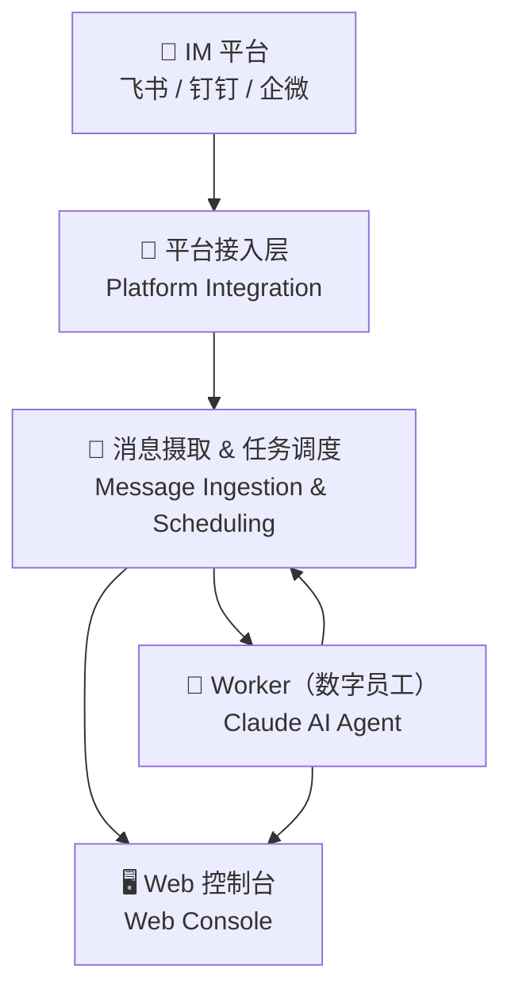

# README Beautification Design

**Date:** 2026-03-18
**Scope:** `README.md` (English) + `README.zh.md` (Chinese)
**Approach:** Option B — GitHub-Standard Rich README

---

## Background

The current READMEs are functionally complete but visually plain. They cover installation (3 methods), quick start (3 steps), how it works (4 layers), Star History, and Community links. Missing elements identified:

- No project Logo / Hero Banner
- No badges (version, license, platform, stars)
- No visual feature highlights
- Architecture described in plain text only
- No table of contents structure

## Goals

Comprehensive brand enhancement targeting:
1. Professional visual identity through SVG-style banner + badge row
2. Scannable feature highlights via emoji grid table
3. Visual architecture through Mermaid diagram
4. Cleaner Quick Start flow with collapsible secondary content
5. Full Chinese ↔ English content parity

**Non-goals:** Screenshots/GIFs (deferred), FAQ/Roadmap/Contributors section (Option C scope).

---

## Design

### 1. Hero Banner

Centered HTML layout using GitHub Markdown's `<div align="center">`:

```markdown
<div align="center">
  <h1>🐝 OpenBee</h1>
  <p><strong>Run Claude AI as your digital employee — command via Lark, DingTalk, or WeCom</strong></p>
</div>
```

Chinese tagline: `让 Claude AI 成为你的数字员工 — 通过飞书/钉钉/企微直接指挥`

### 2. Badge Row

Four badges using shields.io, themed with honey yellow `#F7C948` to match the brand:

```markdown
[](https://www.npmjs.com/package/@theopenbee/cli)
[](LICENSE)
[]()
[]()
```

### 3. Features Section (✨ Features)

3-column HTML table with emoji icons + one-line description per feature. 6 features total (2 rows × 3 columns):

| Column 1 | Column 2 | Column 3 |
|---|---|---|
| 🤖 AI Workers / AI 数字员工 | 💬 Multi-IM / 多平台 IM 接入 | 🧠 Persistent Memory / 持久记忆 |
| 🔧 MCP Tools / MCP 工具调用 | ⏰ Scheduled Tasks / 定时任务 | 🖥️ Web Console / Web 控制台 |

Implementation using `<div align="center">` wrapping a Markdown table for center alignment on GitHub.

### 4. Quick Start Restructure (🚀 Quick Start)

Merge the current separate "Installation" and "Quick Start" sections into a single 4-step flow:

1. **Install** — npm install (primary), with `<details>` collapsing alternative methods (script + manual binary)
2. **Generate config** — `openbee config`
3. **Start service** — `openbee start`
4. **Use** — Web Console URL + IM platform instruction

Key change: alternative installation methods move into a `<details><summary>其他安装方式 / Other install methods</summary>` block, keeping the primary flow clean.

### 5. Architecture Diagram (⚙️ How It Works)

Replace plain-text 4-layer description with a Mermaid flowchart:



The existing text descriptions of the 4 layers are retained below the diagram as supplementary detail.

### 6. Star History (🌟 Star History)

Wrap existing chart in `<div align="center">` for consistent centering.

### 7. Community (🤝 Community)

Add emoji prefixes to bullet items for visual hierarchy:

- 🐛 Bug reports / Feature requests → GitHub Issues
- 🤝 Contributing → Contributing Guide + CLA link

---

## Full Document Structure

```
<Hero Banner>          # centered h1 + tagline
<Badge Row>            # npm | license | platform | stars
<Language Toggle>      # [中文] / [English] link
<One-line intro>       # existing description, kept
## ✨ Features         # NEW: 3×2 emoji grid table
## 🚀 Quick Start     # RESTRUCTURED: 4-step, details collapse
## ⚙️ How It Works    # UPDATED: Mermaid diagram + text
## 🌟 Star History    # KEPT: centered
## 🤝 Community       # UPDATED: emoji bullets
```

---

## Chinese / English Parity Rules

Both files maintain strict section-order parity. Same badge types, same feature count, same Mermaid diagram structure. Only natural language differs:

- `README.md` → English, links to `[中文](README.zh.md)` at top
- `README.zh.md` → Chinese, links to `[English](README.md)` at top

---

## Success Criteria

- GitHub renders Banner, badges, feature table, and Mermaid diagram correctly
- Mermaid diagram visible in GitHub's web UI (native support since 2022)
- Quick Start primary flow fits in a single screen without scrolling
- Both language versions updated and content-consistent
- No broken links or missing badge endpoints
